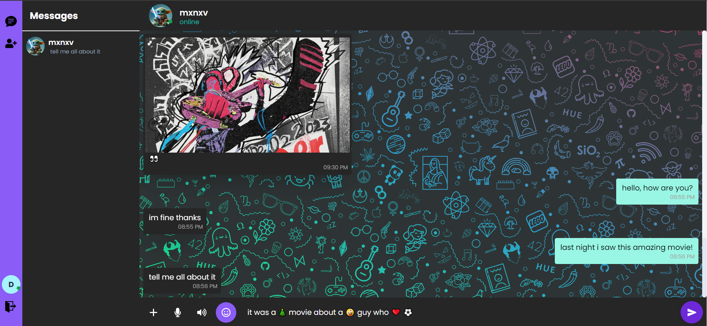

# EmotiChat

EmotiChat is a web-based chat application designed to enhance user communication by offering real-time messaging with the unique ability to translate between text, speech, and emoji formats. The application supports user account creation, enabling personalized profiles with customizable usernames and profile pictures. In addition to real-time chat, EmotiChat allows users to share images and videos, adding a multimedia dimension to their interactions. The project leverages modern web technologies such as ReactJS for the front end, NodeJS for the back end, Tailwind CSS for responsive design, and Cloudinary for multimedia management offering a dynamic and engaging user experience.

### Real-Time Text-Speech-Emoji Inter-Translation: 
One of the most unique features of EmotiChat is its ability to seamlessly translate between text, speech, and emojis. Users can input a message in any of these formats, and can translate it to fit their requirements. For example, a user might type a message in text, and could hear it as spoken words using the Text-to-Speech (TTS) feature or see it translated into emojis. This inter-translation breaks down communication barriers and adds flexibility to how users interact, making the platform more accessible and expressive for everyone.
### User Accounts and Profile Customization: 
EmotiChat allows users to create personalized accounts with their own custom usernames and profile pictures. This feature not only makes the platform feel more personal but also enables users to express their individuality through their profiles. Profile customization options encourage user engagement by offering a tailored experience, while secure authentication ensures the privacy and safety of user data. The ability to update and customize profiles gives users a sense of ownership over their digital identity on the platform.
### Image and Video Sharing:
Beyond text-based communication, EmotiChat supports the sharing of images and videos directly within chat conversations. This feature enables users to enrich their conversations with visual and multimedia content, whether it's for casual sharing, collaboration, or self-expression. The
platform ensures that shared media is optimized for quick loading and high-quality display, regardless of device or internet connection, thanks to integration with a cloud-based media management service.
### Real-Time Chatting with WebSockets: 
Instantaneous message delivery is crucial in chat applications, and EmotiChat achieves this through the use of WebSockets for real-time, bidirectional communication. Messages are sent and received in real time, without the delays that can occur with traditional HTTP request-response methods. This creates a fluid, uninterrupted conversation experience, making the platform feel fast, responsive, and reliable, even with multiple users interacting simultaneously.
### Responsive and Mobile-Friendly Design: 
EmotiChat is designed to be fully responsive, ensuring that users have an optimal experience regardless of the device they are using. Whether on desktop, tablet, or mobile, the platform's layout and features adapt seamlessly, providing a smooth user experience across different screen sizes. This is achieved through a mobile-first approach and the use of Tailwind CSS for responsive design, ensuring that the interface is always easy to use and navigate.

